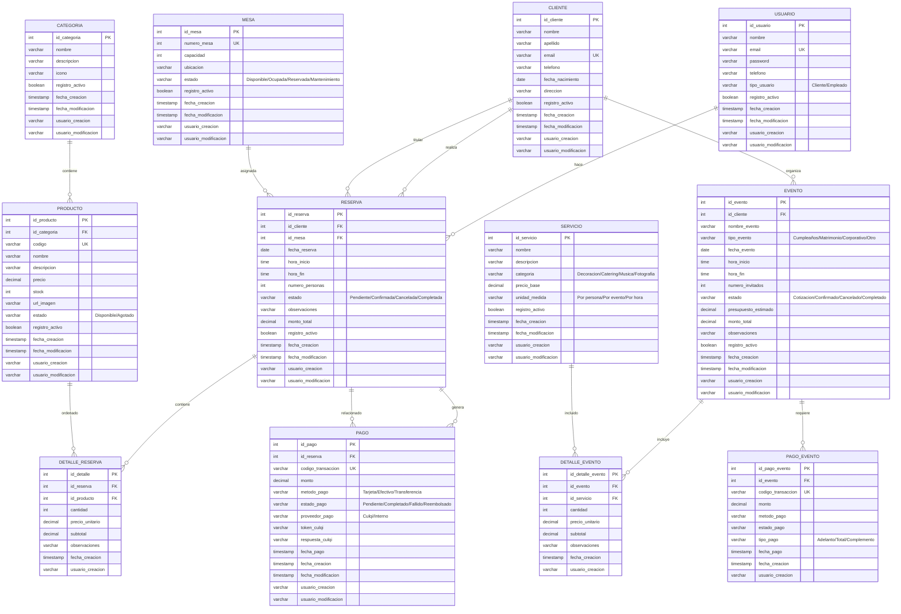

# 🗄️ Diagrama de Base de Datos - Marakos Grill

## 📊 Diagrama Visual de Entidad-Relación

## 📋 Descripción de Microservicios y Tablas

### 🔐 **AUTH-SERVICE (Puerto 8080)**
**Propósito:** Autenticación y autorización del sistema

| Tabla | Descripción | Campos Principales |
|-------|-------------|-------------------|
| `USUARIO` | Usuarios del sistema (clientes y empleados) | id, email, password, tipo_usuario |

### 👥 **CUSTOMER-SERVICE (Puerto 8081)**
**Propósito:** Gestión de información de clientes

| Tabla | Descripción | Campos Principales |
|-------|-------------|-------------------|
| `CLIENTE` | Información detallada de clientes | id, nombre, apellido, email, telefono |

### 🍽️ **MANAGEMENT-SERVICE (Puerto 8082)**
**Propósito:** Gestión de carta y productos del restaurante

| Tabla | Descripción | Campos Principales |
|-------|-------------|-------------------|
| `CATEGORIA` | Categorías de productos (Entradas, Carnes, etc.) | id, nombre, descripcion, icono |
| `PRODUCTO` | Productos del menú | id, codigo, nombre, precio, stock, url_imagen |

### 📅 **RESERVATION-SERVICE (Puerto 8083)**
**Propósito:** Gestión de reservas y mesas

| Tabla | Descripción | Campos Principales |
|-------|-------------|-------------------|
| `MESA` | Mesas del restaurante | id, numero_mesa, capacidad, estado |
| `RESERVA` | Reservas de mesas | id, fecha_reserva, hora_inicio, estado |
| `DETALLE_RESERVA` | Productos ordenados en la reserva | id, cantidad, precio_unitario |

### 💳 **PAYMENT-SERVICE (Puerto 8084)**
**Propósito:** Procesamiento de pagos con Culqi

| Tabla | Descripción | Campos Principales |
|-------|-------------|-------------------|
| `PAGO` | Transacciones de pago | id, codigo_transaccion, monto, estado_pago |

### 🎉 **EVENT-PLANNING-SERVICE (Puerto 8085)**
**Propósito:** Planificación de eventos especiales

| Tabla | Descripción | Campos Principales |
|-------|-------------|-------------------|
| `EVENTO` | Eventos planificados | id, nombre_evento, fecha_evento, presupuesto |
| `SERVICIO` | Servicios disponibles para eventos | id, nombre, categoria, precio_base |
| `DETALLE_EVENTO` | Servicios incluidos en cada evento | id, cantidad, precio_unitario |
| `PAGO_EVENTO` | Pagos relacionados con eventos | id, tipo_pago, monto |

## 🔗 Relaciones Principales

### **Relaciones Inter-Microservicios:**
1. **USUARIO ↔ CLIENTE**: Vinculados por email (un usuario puede ser cliente)
2. **CLIENTE → RESERVA**: Un cliente puede hacer múltiples reservas
3. **CLIENTE → EVENTO**: Un cliente puede organizar múltiples eventos
4. **RESERVA → PAGO**: Cada reserva puede tener múltiples pagos
5. **EVENTO → PAGO_EVENTO**: Cada evento puede tener múltiples pagos

### **Relaciones Intra-Microservicio:**
1. **CATEGORIA → PRODUCTO**: Una categoría contiene múltiples productos
2. **MESA → RESERVA**: Una mesa puede tener múltiples reservas
3. **RESERVA → DETALLE_RESERVA**: Una reserva puede tener múltiples productos
4. **EVENTO → DETALLE_EVENTO**: Un evento puede incluir múltiples servicios

## 📊 Cardinalidades

| Relación | Cardinalidad | Descripción |
|----------|--------------|-------------|
| USUARIO → RESERVA | 1:N | Un usuario puede hacer múltiples reservas |
| CLIENTE → RESERVA | 1:N | Un cliente puede hacer múltiples reservas |
| MESA → RESERVA | 1:N | Una mesa puede ser reservada múltiples veces |
| CATEGORIA → PRODUCTO | 1:N | Una categoría tiene múltiples productos |
| RESERVA → DETALLE_RESERVA | 1:N | Una reserva puede tener múltiples productos |
| RESERVA → PAGO | 1:N | Una reserva puede tener múltiples pagos |
| CLIENTE → EVENTO | 1:N | Un cliente puede organizar múltiples eventos |
| EVENTO → DETALLE_EVENTO | 1:N | Un evento puede tener múltiples servicios |
| SERVICIO → DETALLE_EVENTO | 1:N | Un servicio puede estar en múltiples eventos |

## 🔧 Campos de Auditoría Estándar

Todas las tablas incluyen campos de auditoría:
- `registro_activo`: Boolean para soft delete
- `fecha_creacion`: Timestamp de creación
- `fecha_modificacion`: Timestamp de última actualización
- `usuario_creacion`: Usuario que creó el registro
- `usuario_modificacion`: Usuario que modificó el registro

## 🌐 Integración con Frontend

El frontend Angular se conecta a estos microservicios a través de:
- **AuthService** → AUTH-SERVICE
- **MenuService** → MANAGEMENT-SERVICE  
- **BookingService** → RESERVATION-SERVICE
- **PaymentService** → PAYMENT-SERVICE
- **EventService** → EVENT-PLANNING-SERVICE

## 🔒 Consideraciones de Seguridad

1. **Autenticación JWT** centralizada en AUTH-SERVICE
2. **Validación de datos** en cada microservicio
3. **Cifrado de contraseñas** con BCrypt
4. **Logs de auditoría** en todas las operaciones
5. **Validación de permisos** por tipo de usuario

---

*Este diagrama representa la estructura completa de la base de datos distribuida del sistema Marakos Grill, diseñada con arquitectura de microservicios para escalabilidad y mantenibilidad.*